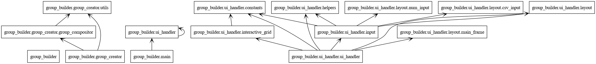
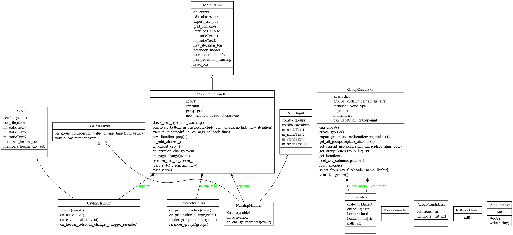

.. Group Builder documentation master file, created by
   sphinx-quickstart on Tue Feb  4 15:28:34 2025.
   You can adapt this file completely to your liking, but it should at least
   contain the root `toctree` directive.

Group Builder documentation
===========================

A simpl GUI application to create groups of people given a CSV file or the number of people per group and the number of groups that should be created.
It was build using WxPython.

.. toctree::
   :maxdepth: 4
   :titlesonly:
   :caption: Contents:

   main
   group_creator/index
   ui_handler/index

Import structure and UML
------------------------

Imports:
^^^^^^^^

   
Class Diagram:
^^^^^^^^^^^^^^

Indices and tables
------------------

* :ref:`genindex`
* :ref:`modindex`
* :ref:`search`